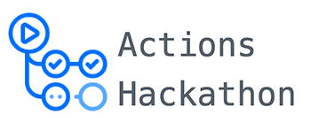

<center>
<br>
<h3> Class Attender Action</h3>
<hr>
</center>

This repository is dedicated to a GitHub Action for running a cron job, every morning at 11 AM to attend my super boring **OOPS** Classes.

<pre>
THIS REPOSITORY WAS CREATED AS A PART OF ACTIONS HACKATHON HOSTED BY DEV.TO AND GITHUB,
</pre>

### SECRETS

  Make sure to add 3 secrets in your project, by going to 
  
  <pre><b>Project Settings > Secrets > New Secret.</b></pre>

  The Format for these 3 secrets is as below :

  <pre>
    # Contains Your Google Account Email Address
    <b>USER_EMAIL</b>     
    
    # Contains Your Google Account Password
    <b>USER_PASSWORD</b>  

    # Add the Link for the Google Meet you'd like to join.
    <b>MEET_LINK</b>      
  </pre>

### Usage
Example Workflow file

An example workflow to set up your class attender action quickly.

```yaml
name: Class Attender

on:
  # Set the time here
  schedule:
    - cron: "0 11 * * *" # 11 AM Every Morning

jobs:
  build:
    runs-on: ubuntu-latest
    strategy:
      matrix:
        python-version: [3.7]

    steps:
      - uses: actions/checkout@v2
      - name: Set up Python ${{ matrix.python-version }}
        uses: actions/setup-python@v2
        with:
          python-version: ${{ matrix.python-version }}

      - name: Setup Chromedriver
        uses: nanasess/setup-chromedriver@master
      - run: |
          export DISPLAY=:99
          chromedriver --url-base=/wd/hub &
          sudo Xvfb -ac :99 -screen 0 1280x1024x24 > /dev/null 2>&1 &

      - name: Install dependencies
        run: |
          python -m pip install --upgrade pip
          pip install selenium pyvirtualdisplay pause

      - name: RUN
        run: |
          python ./script.py ${{ secrets.USER_EMAIL }} ${{ secrets.USER_PASSWORD }} ${{ secrets.MEET_LINK }}

```

### Learn More

You can learn more about Github actions [here](https://docs.github.com/en/actions).


##### Made with ♥ by <a href="https://github.com/ishandeveloper">ishandeveloper</a>

[](https://github.com/ishandeveloper)